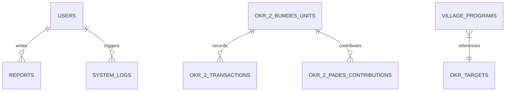

# Analisis Projek: Dashboard Monitoring & Evaluasi Desa Binangun

Dokumen ini berisi analisis menyeluruh mengenai aplikasi **Dashboard Monitoring dan Evaluasi Desa Binangun**. Dokumen ini dirancang untuk memberikan pemahaman teknis dan fungsional dari projek ini secara terperinci.

---

## 1. Deskripsi Umum Projek
Aplikasi ini adalah dashboard berbasis **Laravel 11** yang dirancang untuk memantau dan mengevaluasi kinerja pembangunan, ekonomi, dan kapasitas sumber daya manusia di Desa Binangun berdasarkan kerangka kerja **OKR (Objectives and Key Results)**.

### Stack Teknologi Utama
- **Framework**: Laravel 11 (PHP 8.2+)
- **Database Relasional**: SQLite / MySQL (Menggunakan ORM Eloquent)
- **Frontend**: HTML5, Blade Templates, Vanilla CSS, JS/Chart.js untuk grafik visualisasi.
- **Pola Arsitektur**: Service-Repository Pattern (Clean Architecture di tingkat dasar) untuk memisahkan logika matematika/bisnis dari controller.

---

## 2. Struktur Data & Model Database

Berikut adalah relasi antar tabel utama di dalam sistem:

### Model Utama dalam Kode
1. **[User.php](file:///c:/Users/hamka/OneDrive/Desktop/Dashboard-Monitoring-dan-Evaluasi-Desa-Binangun/app/Models/User.php)**
   Mengelola data akun pengguna, role-based access control (RBAC), serta status Two-Factor Authentication (2FA).
2. **[OkrTarget.php](file:///c:/Users/hamka/OneDrive/Desktop/Dashboard-Monitoring-dan-Evaluasi-Desa-Binangun/app/Models/OkrTarget.php)**
   Menyimpan target tahunan OKR untuk 3 pilar kinerja (Partisipasi, BUMDes, SDM) beserta status verifikasi RKP, Pagu Anggaran, dan persetujuan BPD.
3. **[Okr1Partisipasi.php](file:///c:/Users/hamka/OneDrive/Desktop/Dashboard-Monitoring-dan-Evaluasi-Desa-Binangun/app/Models/Okr1Partisipasi.php)**
   Menyimpan data tingkat partisipasi warga per bulan (jumlah wajib lapor vs warga hadir).
4. **[Okr2BumdesUnit.php](file:///c:/Users/hamka/OneDrive/Desktop/Dashboard-Monitoring-dan-Evaluasi-Desa-Binangun/app/Models/Okr2BumdesUnit.php)**
   Menampung daftar unit usaha BUMDes (Badan Usaha Milik Desa) beserta modal awal dan penanggung jawab.
5. **[Okr2Transaction.php](file:///c:/Users/hamka/OneDrive/Desktop/Dashboard-Monitoring-dan-Evaluasi-Desa-Binangun/app/Models/Okr2Transaction.php)**
   Mencatat arus keuangan masuk (Pemasukan) dan keluar (Pengeluaran) dari setiap unit BUMDes.
6. **[Okr2PadesContribution.php](file:///c:/Users/hamka/OneDrive/Desktop/Dashboard-Monitoring-dan-Evaluasi-Desa-Binangun/app/Models/Okr2PadesContribution.php)**
   Mencatat setoran Pendapatan Asli Desa (PADes) dari keuntungan unit BUMDes, lengkap dengan bukti transfer/upload file.
7. **[Okr3SdmCapacity.php](file:///c:/Users/hamka/OneDrive/Desktop/Dashboard-Monitoring-dan-Evaluasi-Desa-Binangun/app/Models/Okr3SdmCapacity.php)**
   Menilai kapasitas staf/perangkat desa berdasarkan jumlah pelatihan, rata-rata nilai kompetensi, dan persentase keaktifan kinerja.
8. **[VillageProgram.php](file:///c:/Users/hamka/OneDrive/Desktop/Dashboard-Monitoring-dan-Evaluasi-Desa-Binangun/app/Models/VillageProgram.php)**
   Melacak status dan persentase penyelesaian program desa yang dihubungkan ke salah satu OKR.
9. **[Report.php](file:///c:/Users/hamka/OneDrive/Desktop/Dashboard-Monitoring-dan-Evaluasi-Desa-Binangun/app/Models/Report.php)**
   Mengelola dokumen laporan desa dengan status Draft atau Published.
10. **[SystemLog.php](file:///c:/Users/hamka/OneDrive/Desktop/Dashboard-Monitoring-dan-Evaluasi-Desa-Binangun/app/Models/SystemLog.php)**
    Menyimpan jejak audit sistem yang bersifat *immutable* (tidak dapat diubah/dihapus) untuk keamanan.

---

## 3. Matriks Peran Pengguna (Role-Based Access Control)

Aplikasi memiliki 4 role utama dengan wewenang yang dibatasi secara ketat di tingkat middleware:

| Fitur / Modul | Administrator | Kepala Desa | Tim Monitoring | BPD |
| :--- | :---: | :---: | :---: | :---: |
| **Kelola Target Tahunan** | Ya (Edit) | Ya (Edit) | Hanya Lihat | Hanya Lihat |
| **Mutasi Data OKR (1, 2, 3)** | Ya (Input/Edit) | Hanya Lihat | Ya (Input/Edit) | Hanya Lihat |
| **Kelola Program Desa (Create/Update)** | Ya | Hanya Lihat | Ya | Hanya Lihat |
| **Hapus Program Desa** | Ya | Tidak | Tidak | Tidak |
| **Draft Laporan Baru** | Ya | Ya | Ya | Tidak |
| **Publish Laporan Desa** | Ya | Ya | Tidak | Tidak |
| **Hapus Laporan Desa** | Ya | Tidak | Tidak | Tidak |
| **Akses Halaman Audit Log** | Ya | Ya | Tidak | Tidak |
| **Ekspor CSV Audit Log** | Ya | Tidak | Tidak | Tidak |

---

## 4. Fitur Utama Sistem secara Terperinci

### A. Autentikasi & Keamanan Akun
- **Registrasi Akun Admin Khusus**: Pendaftaran admin dibatasi dengan validasi wajib NIP 13-digit angka unik dan kata sandi berkekuatan tinggi (kombinasi huruf besar, kecil, dan angka).
- **Two-Factor Authentication (2FA)**: Pengguna dapat mengaktifkan/menonaktifkan 2FA melalui menu pengaturan keamanan.
- **Revokasi Sesi Perangkat Aktif**: Halaman pengaturan menampilkan daftar sesi aktif (termasuk deteksi tipe browser, perangkat, lokasi IP, dan aktivitas terakhir). Pengguna dapat mencabut (*revoke*) akses sesi dari jarak jauh.

### B. Visualisasi Dashboard Utama
- **Metrik Utama (Top Cards)**: Menampilkan total omzet BUMDes, laba bersih, setoran PADes, dan persentase partisipasi warga lengkap dengan indikasi tren naik/turun bulanan.
- **Bagan Pencapaian OKR**: Radial chart yang merepresentasikan persentase rata-rata ketercapaian target OKR 1, OKR 2, dan OKR 3.
- **Analisis Tren & Komparasi**:
  - Grafik garis untuk tren partisipasi bulanan.
  - Grafik batang untuk perbandingan Target vs Realisasi omzet BUMDes.
  - Donut chart untuk sebaran status program desa (PENDING, AKTIF, SELESAI).
- **Aktivitas Terbaru**: Feed langsung berisi 10 baris jejak log sistem terbaru.

### C. Modul Evaluasi Kinerja (OKR)
1. **OKR 1 - Partisipasi & Kegiatan Desa**:
   - Menghitung persentase tingkat kehadiran musyawarah bulanan dengan formula: `(Warga Hadir / Warga Wajib Lapor) * 100`.
   - Menentukan status pencapaian OKR 1 secara dinamis: `ON TRACK` (>= 80%), `AT RISK` (60% - 79%), atau `BEHIND` (< 60%).
2. **OKR 2 - Penguatan Ekonomi (BUMDes)**:
   - Pencatatan arus transaksi masuk dan keluar untuk setiap unit usaha BUMDes.
   - Perhitungan otomatis laba bersih per bulan.
   - Fitur setoran PADes dengan aturan ketat PerDes.
3. **OKR 3 - Kapasitas SDM Perangkat**:
   - Evaluasi kapasitas organisasi secara berkala.
   - Penilaian mencakup skor kompetensi rata-rata (skala 1-10) dan keaktifan kinerja (%).
   - Indikator tren persentase peningkatan kapasitas dibandingkan periode sebelumnya.

### D. Manajemen Program & Laporan Desa
- **Program Kerja Desa**: Pelacakan program pembangunan desa. Perubahan status menjadi `SELESAI` akan otomatis memaksa tingkat kemajuan (*progress*) menjadi 100%. Program berstatus `AKTIF` tidak dapat dihapus untuk mencegah hilangnya data berjalan.
- **Publikasi Laporan**: Pembuatan laporan dalam bentuk draft yang nantinya harus ditinjau dan diterbitkan (*publish*) oleh Kepala Desa atau Administrator agar dapat dibaca publik.

### E. Jejak Audit & Log Keamanan (Audit Trail)
- Sistem mencatat secara otomatis setiap tindakan penting (seperti perubahan data, unggah berkas, kegagalan login, dan upaya akses ilegal) ke dalam tabel `system_logs`.
- Data log bersifat *immutable* (tidak dapat diubah/dihapus) dan mendeteksi IP address serta User Agent klien.
- Ekspor log dalam format CSV (khusus Admin) menggunakan teknik *Streamed Response* untuk menghemat penggunaan memori server ketika menangani ribuan baris data.

---

## 5. Logika Bisnis & Aturan Validasi Khusus

> [!IMPORTANT]
> **Aturan Validasi Kontribusi PADes (Aturan PerDes)**
> Sesuai Peraturan Desa Binangun, setoran PADes dari unit BUMDes **wajib minimal 25% dari laba bersih bulanan** unit tersebut. 
> 
> Logika validasi didefinisikan pada [OkrService.php](file:///c:/Users/hamka/OneDrive/Desktop/Dashboard-Monitoring-dan-Evaluasi-Desa-Binangun/app/Services/OkrService.php#L119-L155):
> - Jika laba bersih unit <= 0, setoran ditolak karena laba belum mencukupi.
> - Jika nominal setoran kurang dari 25% laba bersih bulanan, sistem akan memblokir penyimpanan data dan mengembalikan pesan error detail berisi jumlah minimal yang harus disetor.

---

## 6. Struktur Direktori Kode Utama

- **Model Data**: [app/Models/](file:///c:/Users/hamka/OneDrive/Desktop/Dashboard-Monitoring-dan-Evaluasi-Desa-Binangun/app/Models)
- **Controller Web**: [app/Http/Controllers/](file:///c:/Users/hamka/OneDrive/Desktop/Dashboard-Monitoring-dan-Evaluasi-Desa-Binangun/app/Http/Controllers)
- **Service Layer (Logika Bisnis)**: [app/Services/](file:///c:/Users/hamka/OneDrive/Desktop/Dashboard-Monitoring-dan-Evaluasi-Desa-Binangun/app/Services)
- **File Routing**: [routes/web.php](file:///c:/Users/hamka/OneDrive/Desktop/Dashboard-Monitoring-dan-Evaluasi-Desa-Binangun/routes/web.php)
- **Template Tampilan (Blade)**: [resources/views/](file:///c:/Users/hamka/OneDrive/Desktop/Dashboard-Monitoring-dan-Evaluasi-Desa-Binangun/resources/views)
